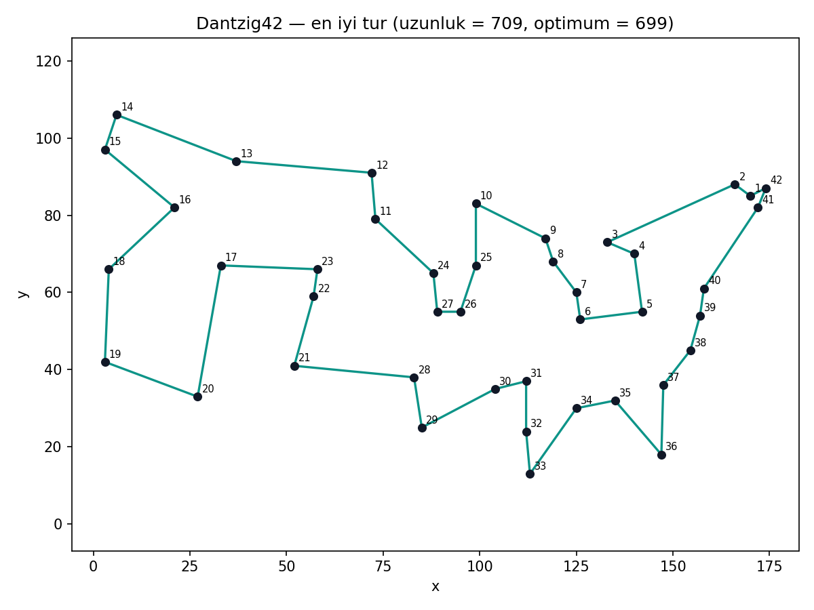
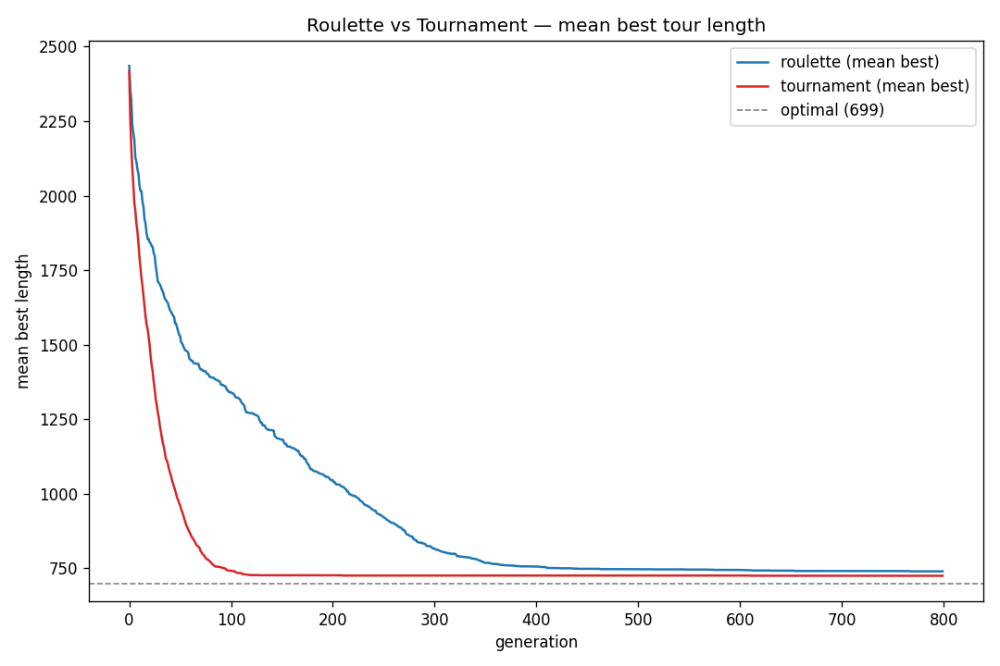
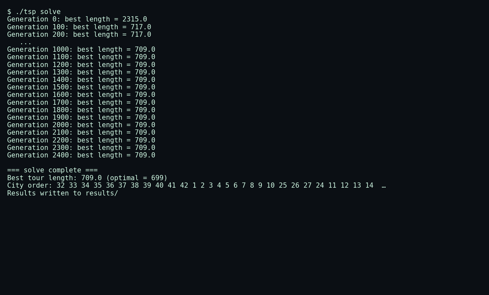
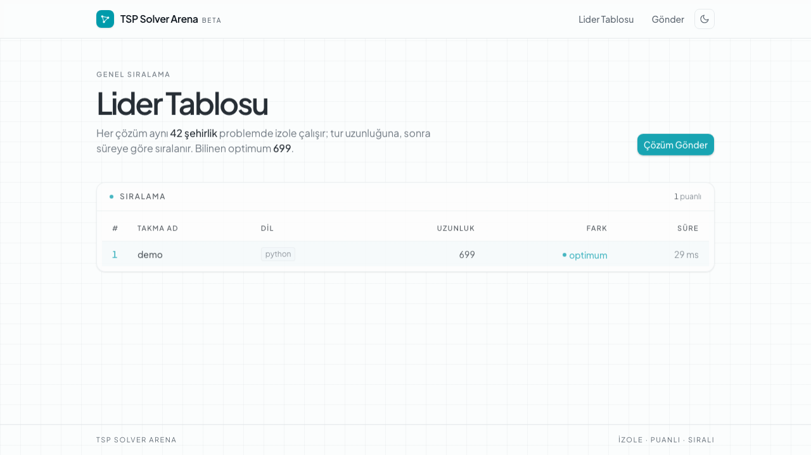
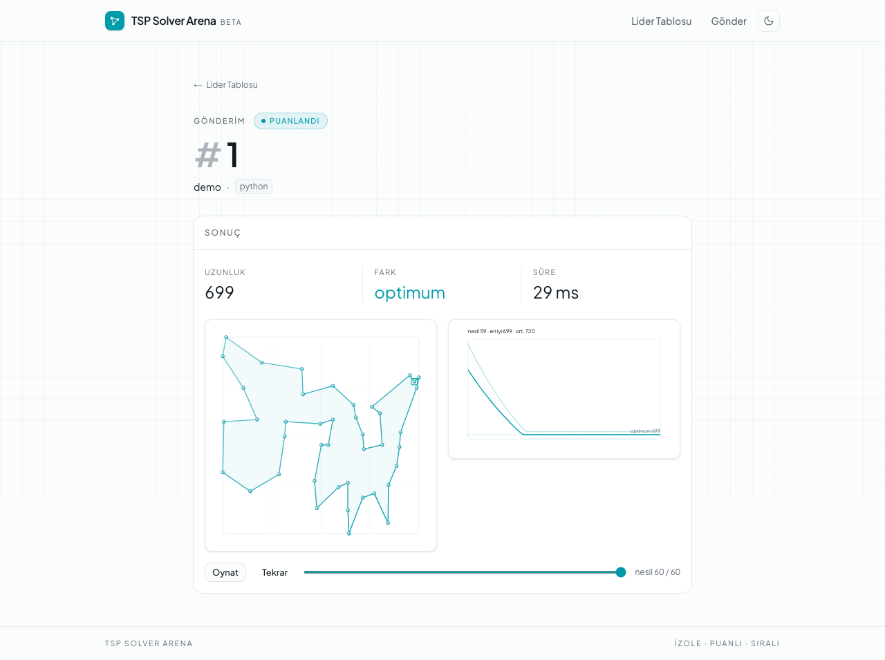

# Dantzig42 Gezgin Satıcı Problemi — Genetik Algoritma + Arena

Bu reponun ana amacı vize ödevini teslim etmek, diğer işi ise diğerlerinin çözümlerini karşılaştırabileceği bir platform sağlamak.

Problemin bilinen en kısa kapalı tur uzunluğu **699**. Benim genetik algoritmam, sabit seed ile tekrarlanabilir biçimde **709** buluyor — optimuma yaklaşık **%1.4** uzaklıkta.

## Yaklaşım

Genetik algoritmamın modeli şu:

- **Gen** bir şehir; **birey (sample)** ise şehirlerin bir permütasyonu, yani bir tur.
- **Uygunluk (fitness)** = 1 / tur uzunluğu. Bu numara sayesinde, uygunluğu *maksimize* eden klasik genetik algoritma aslında tur mesafesini *minimize* etmiş oluyor.
- **Operatörler:** PMX (Partially Mapped Crossover) çaprazlaması, ters-çevirme (inversion) mutasyonu ve elitizm.
- **Seçilim:** hem Rulet Tekerleği (Roulette-Wheel) hem de Turnuva (Tournament) seçilimini yazdım, ikisini karşılaştırdım ve turnuvanın belirgin biçimde daha iyi olduğunu görünce onu varsayılan yaptım.

Kod `GeneticAlgorithm/` altında ayrı sınıflara bölünmüş durumda (`Population`, `Sample`, `Algorithm`, `FitnessCalculator`, `GeneModel`, `Utility`). Parametreler tek yerde, `configureGA()` içinde toplandı.

## Parametreler

| Parametre | Değer |
|---|---|
| Popülasyon | 320 |
| Nesil sayısı | 2500 |
| Nesil başına çaprazlama | 160 |
| Elit birey | 2 |
| Mutasyon (inversion) oranı | 0.35 |
| Turnuva boyutu | 4 |
| Çaprazlama | PMX |
| Seçilim | Turnuva |

## Sonuçlar

Algoritma her turda (seed sabit, `Utility::seed(42)`) **709** uzunluğunda bir tur buluyor. Optimum 699'a göre yaklaşık %1.4 fark. İlk birkaç yüz nesilde hızlı bir düşüş oluyor, ardından çözüm 709 civarında oturuyor.

En iyi turun 42 şehrin koordinatları üzerindeki çizimi:



Rulet ile turnuvayı her biri 10 koşu olacak şekilde karşılaştırdığımda turnuva hem daha hızlı yakınsadı hem de daha iyi sonuç verdi. Ortalama final tur uzunluğu **turnuva: 724.5**, **rulet: 739.5** (turnuva kabaca 5 kat daha hızlı toparlanıyor ve dağılımı da daha dar):



Programın çalışırken verdiği çıktı (en iyi uzunluğun nesiller boyunca 709'a inişi ve sonuç):



Turun nesiller boyunca optimuma yaklaşmasını gösteren bir animasyon da `visualize.py` ile üretiliyor (`results/tour.mp4`). Bu videoyu repoda yok ama mail ekinde var.

## Parametreleri nasıl seçtim

Dantzig42'de genetik algoritma erken yakınsama (premature convergence) eğiliminde: elitist eleme, PMX ve tek-parça inversion ile popülasyon neredeyse her ayarda ~100. nesil civarında çöküyor (en iyi == ortalama), ondan sonra sadece nesil eklemek hiçbir şey değiştirmiyor. Bu yüzden ayarı yaparken daha fazla nesil yerine nerede yakınsadığını etkileyen kollara odaklandım: popülasyon büyüklüğü, mutasyon oranı, elitizm ve turnuva boyutu. Her adayı yalnızca tek bir seed'de değil, **20 farklı seed'de ortalayarak** değerlendirdim. Böylece seçilen ayar tek bir şanslı tura göre değil, dağılıma göre en iyisi oldu. Seçtiğim **320 / 0.35 / 2 elit / turnuva 4 / 2500 nesil** kombinasyonu denediklerim arasında hem en iyi ortalamaya hem de en dar dağılıma sahipti, bazı seedlerde 699'u da yakalıyor.

## Kurulum & Çalıştırma

Derlemek için tek komut yeterli:

```bash
make
```

Çalıştırma:

```bash
./tsp solve        # tek tur: results/ klasörünü oluşturur
./tsp experiment   # Rulet vs Turnuva, her biri 10 tur -> results/experiment.csv
```

Görselleştirme matplotlib kullanıyor. `make` hedefleri proje-içi bir sanal ortamı (`.venv`) ilk kullanımda kendiliğinden kurar.

```bash
make viz       # canlı animasyon: tur açılırken + en iyi/ortalama uygunluk eğrileri
make compare   # Rulet vs Turnuva grafiği (results/selection_comparison.png)
```

(`make viz`'den önce `./tsp solve`, `make compare`'den önce `./tsp experiment` çalıştırmalısınız.) Animasyonu doğrudan videoya kaydetmek için: `.venv/bin/python3 visualize.py --save results/tour.mp4`.

## Arena

Herkes kendi TSP çözücüsünü gönderebilseydi ve hepsi aynı problemde adil biçimde yarışsaydı sorusunun cevabı olarak bir arena oluşturdum. Katılmak isteyen herhangi biri herhangi bir dilde (Python, C++, Go, Rust, Node, Java) bir çözüm yüklüyor, arena onu çalıştırıp 699'a göre puanlıyor, sonucu bir **lider tablosunda** sıralıyor ve çözümün nasıl evrildiğini **animasyonla** oynatıyor.

Gönderim formunda dosyalar sekmeli bir düzenleyiciyle yönetiliyor; birden çok dosya yüklenebiliyor (örneğin C++ için ayrı başlık dosyaları) ve dosyalar doğrudan sürükle-bırak ile eklenebiliyor. Her gönderimin çalışma klasörüne, ödevdekiyle aynı biçimdeki problem verisi (`cityData.txt` ve `intercityDistance.txt`) otomatik olarak konuyor — çözücüler bu dosyaları okuyabilir ya da yok sayabilir.

Yerelde çalıştırmak için (Docker gerektirmeden, sadece Python çözümleri için hızlı mod):

```bash
# backend
cd arena/backend && ARENA_RUNNER=local .venv/bin/uvicorn arena_core.app:build_app --factory --port 8000
# frontend
cd arena/frontend && npm run dev
```

Lider tablosu ve bir gönderinin animasyonlu detay sayfası:





## Dizin yapısı

```
GeneticAlgorithm/     C++ genetik algoritma (Population, Sample, Algorithm, ...)
tests/                C++ birim testleri + Python görselleştirme testleri
visualize.py          canlı animasyon / video
compare_selection.py  Rulet vs Turnuva grafiği
tools/                yardımcı betikler (en iyi turun çizimi)
assets/               README görselleri
arena/                Arena (backend + frontend)
```
